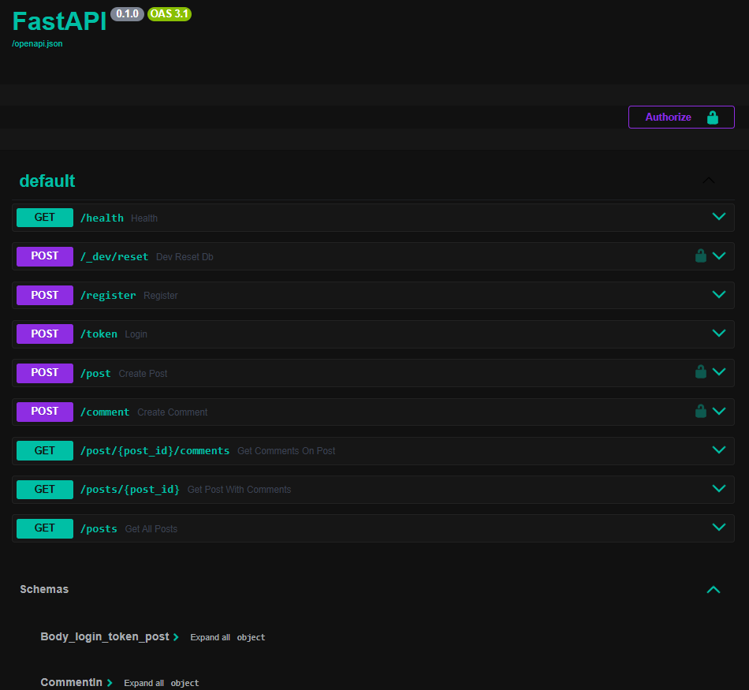

<p align="center">
  
</p>

# 🏗️ FastAPI Mini-Blog API

A small FastAPI backend API for a mini-blog, with JWT authentication, posts, comments, tests, and configurable SQLite/PostgreSQL database support.

---

## 🚀 Features
- **JWT authentication** using `/register` (user creation + token) and `/token` (OAuth2 form login)
- **Protected write endpoints** `/post` and `/comment`
- **Nested read** via `GET /posts/{id}` returning a post with its comments
- **Clean responses** hiding internal database fields
- **Configurable SQLite/PostgreSQL database support** using SQLAlchemy Core tables

---

## 📦 Setup
```bash
pip install -r requirements.txt
cp .env.example .env
uvicorn main:app --reload --env-file .env
```

`DATABASE_URL` controls the database backend. SQLite is used by default when `DATABASE_URL` is not set. PostgreSQL can be used by setting `DATABASE_URL` to a PostgreSQL connection string.

> `python-multipart` (included in `requirements.txt`) is required for the OAuth2 form at `/token`.

---

## 🔐 Authentication

### 1. Register
```http
POST /register
Content-Type: application/json

{
  "username": "blue_caterpillar",
  "password": "mushroom42"
}
```
**201 Created** → returns an access token.

### 2. Log in through Swagger
- Open `/docs`
- Click **Authorize**
- Enter `username` and `password`  
  Swagger will attach the token automatically to subsequent requests.

### 3. Direct token request (optional)
```http
POST /token
Content-Type: application/x-www-form-urlencoded

username=blue_caterpillar&password=mushroom42
```
**200 OK** → returns an access token.

---

## 🧱 Endpoints

### Posts
| Method | Path | Auth | Response |
|:--:|:--|:--:|:--|
| `POST` | `/post` | ✅ | **201** → `UserPost` |
| `GET` | `/posts` | ❌ | `List[UserPost]` |
| `GET` | `/posts/{id}` | ❌ | `UserPostWithComments` |

**Example**
```text
{
  "id": 1,
  "body": "My first post",
  "comments": [
    { "id": 1, "body": "Nice work!" }
  ]
}
```

### Comments
| Method | Path | Auth | Response |
|:--:|:--|:--:|:--|
| `POST` | `/comment` | ✅ | **201** → `CommentOut` |
| `GET` | `/post/{id}/comments` | ❌ | `List[CommentOut]` |

**Example**
```text
{ "id": 1, "body": "Nice work!" }
```

**Foreign-key validation**  
`POST /comment` verifies that `post_id` exists in the `posts` table:  
```text
HTTP/1.1 404 Not Found
{ "detail": "Post not found" }
```

---

### Health

`GET /health`  
Returns a simple liveness probe:
```json
{ "status": "ok" }
```

### Dev Maintenance (local use only)

`POST /_dev/reset` → **204 No Content**  
Clears comments, then posts (guarded; requires maintainer account).  
Use only on local/dev databases.

---

## 🧩 Models (summary)

- `UserPost`: `{ id, body }`  
- `CommentOut`: `{ id, body }`  
- `UserPostWithComments`: `{ id, body, comments: CommentOut[] }`

---

## 🛠️ Future Extensions
- Pagination: `GET /posts?limit=&skip=` and `GET /post/{id}/comments?limit=&skip=`

---

## ✅ Quick Verification
1. Open `/docs` and **Authorize** with your credentials.  
2. Create a post → `POST /post` (**201 Created**).  
3. Create a comment for that post → `POST /comment` (**201 Created**).  
4. Retrieve nested data → `GET /posts/{id}` to see comments embedded.

---

> _Originally inspired by the Teclado FastAPI course._  
> _Extended, debugged, and documented independently._
